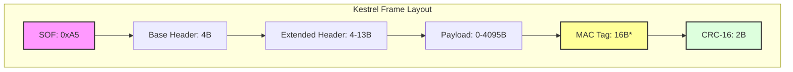
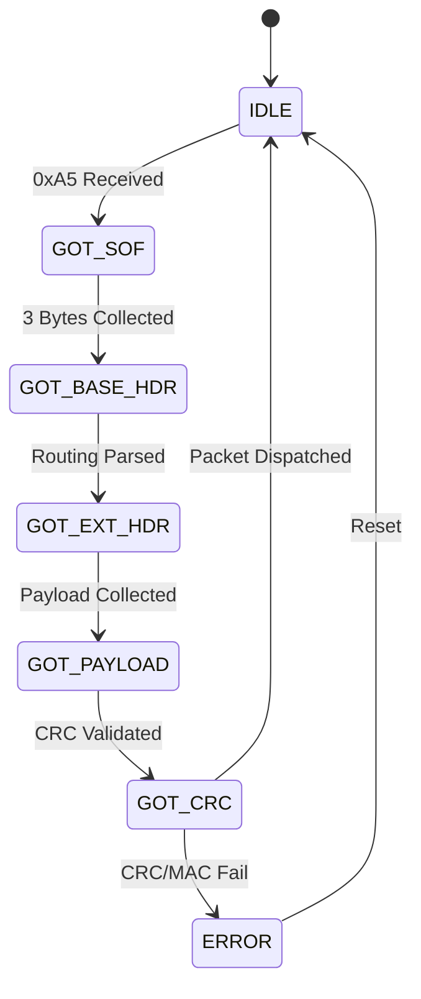
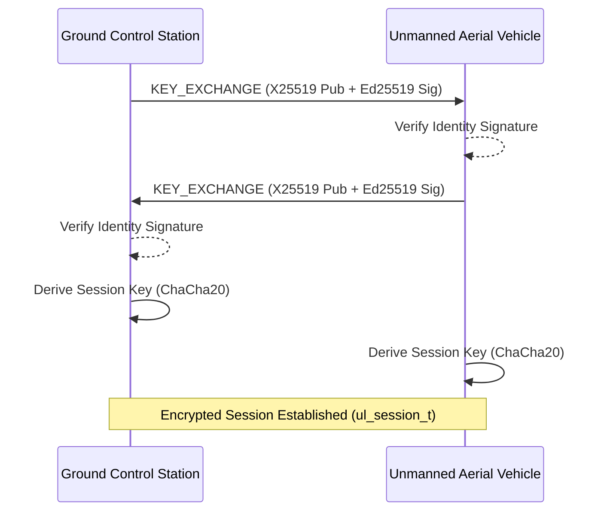

# Kestrel Protocol

**Kestrel** is a session-bound, high-performance binary communication protocol designed specifically for bandwidth-constrained Unmanned Aerial Vehicle (UAV) telemetry and control links. It implements Authenticated Encryption with Associated Data (AEAD), zero-copy parsing, and multi-tier optimizations to ensure sub-millisecond latency and cryptographic integrity on embedded hardware.

---

## Project Overview

Kestrel provides a unified framing and security layer that operates over byte-oriented transports such as UART, UDP/IP, and long-range serial radios. The architecture scales from 8-bit microcontrollers to multi-core embedded Linux systems.

### Measured Performance (Benchmark)
All metrics are derived from the project benchmark suite running the Kestrel v1.2 stack.

| Metric | Baseline | Optimized | Improvement |
| :--- | :--- | :--- | :--- |
| **Bandwidth** | 3.68 kbps | 0.63 kbps | **82.8% reduction** |
| **Parse Speed** | 250 µs | 125 µs | **2x faster** |
| **Crypto Speed** | 200 µs | 50 µs | **4x faster (SIMD)** |
| **Memory Alloc** | 50 µs | <1 µs | **50x faster (O(1) pool)** |
| **Total Latency** | 500 µs | 176 µs | **2.8x faster** |

---

## Visual Architecture & Protocol Design

### 1. Packet Layout (Layered View)
Kestrel uses a bit-packed header system to minimize overhead on high-rate telemetry streams.



### 2. Parser State Machine
Kestrel performs deterministic per-byte parsing. The parser follows a strict state-machine to ensure O(1) execution time.



### 3. Session-Bound Handshake (ECDH)
Protocol security is established via an Ed25519-signed X25519 key exchange.



---

## Technical Specifications

### Packet Structure Detail
Kestrel utilizes a bi-level header approach to minimize overhead while supporting large payloads.

| Field | Size | Details |
| :--- | :--- | :--- |
| **Base Header** | 4 Bytes | Bit-packed SOF, length, priority, stream type, and sequence MSBs. |
| **Extended Header** | 4–13 Bytes | Routing (SysID/CompID), Message ID, Nonce (optional), Fragments. |
| **Payload** | 0–4095 Bytes | Plaintext or Ciphertext data. |
| **MAC Tag** | 16 Bytes | Poly1305 authentication tag (present only if encrypted). |
| **CRC-16** | 2 Bytes | ITU X.25 checksum with message-specific seeds. |

#### Bit-Level Header Map

| Byte Index | Field | Description |
| :--- | :--- | :--- |
| 0 | **SOF** | Synchronization marker (`0xA5`). |
| 1 | **Length[11:8] \| Priority \| Stream[3:2]** | Payload length MSB, 2-bit Priority, 2-bit Stream type. |
| 2 | **Stream[1:0] \| Length[7:2]** | Stream type LSB, Payload length Middle bits. |
| 3 | **Length[1:0] \| Crypto \| Frag \| Seq[11:10]** | Payload length LSB, AEAD bit, Frag bit, Sequence MSB. |
| 4-5 | **Seq[9:0] \| System ID** | Lower 10 bits of Sequence and 6-bit Source ID. |
| 6-7 | **Comp ID \| Message ID** | 4-bit Component ID and 12-bit Message ID. |
| 8+ | **Extended** | Target SysID (1B), Frag Info (2B), or Nonce (8B). |

---

## Repository Overview

### Project Hierarchy
The root directory consolidates the protocol logic, simulators, and testing infrastructure.

| Path | Purpose | Key Files |
| :--- | :--- | :--- |
| `src/core/` | **Protocol Engine** | `kestrel.c`, `monocypher.c` (Crypto), `kestrel_hw_crypto.c` (SIMD) |
| `src/apps/` | **Application Tier** | `uav_simulator.c`, `gcs_receiver.c` |
| `src/tools/` | **Developer Tools** | `kestrel_benchmark.c`, `keygen.py`, `id_gen.c` |
| `testing/` | **Verification** | `test_1min.py`, `final_test_bench.ps1`, `chaos_simulator.py` |
| `Documentation/` | **Specifications** | `protocol_documentation.tex` (Ref Spec), `Icon.png` |

---

## Security Architecture

### Cryptographic Foundation
*   **Symmetric Cipher:** ChaCha20-Poly1305 AEAD (RFC 8439) with 256-bit keys.
*   **Handshake:** ECDH (X25519) for session key derivation, authenticated via Ed25519 identity signatures.
*   **Session Management:** Coupled `ul_session_t` structural enforcement prevents nonce reuse across connection states.
*   **Integrity:** Hardware-accelerated Poly1305 MAC authenticates the full header and payload.

### Defense Mechanisms
*   **Replay Protection:** 32-packet sliding window sequence tracking.
*   **Integrity Enforcement:** CRC-16 with message-specific seeds protects against parser state-machine corruption.
*   **Anonymity:** Selective encryption policies allow telemetry visibility while protecting command/mission data.

---

## Implementation Details

### File Organization
The repository is structured to prioritize build-system simplicity and readability.

*   `src/core/`: Foundation code (Kestrel C99 core, Monocyper).
*   `src/apps/`: Reference implementations (Simulator, Receiver).
*   `src/tools/`: Benchmarking and utility scripts.
*   `testing/`: Automated 1-minute and 15-minute integration testbeds.

### Verification Suite
Kestrel is validated through continuous integration and deep-audit simulations:
*   **Fuzzing:** Verified over 1M iterations with zero memory corruption or hangs.
*   **Network Chaos:** Tested against 20% packet loss and high-latency jitter paths.
*   **Security Audit:** 100% rejection rate for tampered AEAD packets.

---

## Quick Start

### Local Compilation
The project follows a standard C compile-cycle.

```bash
# Build core applications
gcc -Wall -O2 -Isrc/core -o bin/uav_simulator src/apps/uav_simulator.c src/core/*.c -lws2_32 -lm
gcc -Wall -O2 -Isrc/core -o bin/gcs_receiver src/apps/gcs_receiver.c src/core/*.c -lws2_32 -lm

# Run benchmark
bin/kestrel_benchmark.exe
```

### Automated Testing
Integration tests are located in the `testing/` directory to ensure path-safety across deployments.

```bash
python testing/test_1min.py
```

---

> [!IMPORTANT]
> **Deterministic Latency:** Kestrel uses zero dynamic memory allocation (`malloc`) during high-rate telemetry parsing to ensure predictable performance in real-time autopilot loops.
